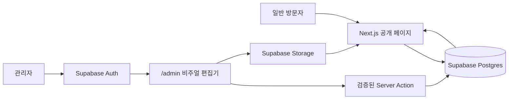

# PORTFOLIO

> 콘텐츠와 화면을 함께 편집할 수 있는 개인 포트폴리오 CMS

- **공개 사이트:** [portfolio-yusung.vercel.app](https://portfolio-yusung.vercel.app)
- **관리자 화면:** [portfolio-yusung.vercel.app/admin](https://portfolio-yusung.vercel.app/admin)
- **배포:** Vercel · **데이터/Auth/Storage:** Supabase

## 프로젝트 소개

- 방문자는 카드형 무한 캐러셀을 통해 소개, 경력, 프로젝트, 연락처를 탐색할 수 있습니다.
- 관리자는 별도의 코드 수정 없이 실제 포트폴리오 화면을 보면서 콘텐츠와 디자인을 편집할 수 있습니다.
- 저장된 콘텐츠는 Supabase의 JSONB 문서로 관리되며, 공개 화면은 요청 시 최신 발행본을 조회합니다.
- 데이터는 화면에 표시되기 전 Zod 스키마로 다시 검증합니다.

## 주요 기능

### 공개 포트폴리오

- 양옆 카드가 함께 보이는 무한 순환형 캐러셀
- 하단 번호 또는 인접 카드를 클릭하는 섹션 이동
- 소개, 기술, 경력, 프로젝트, 연락처 콘텐츠 제공
- 데스크톱과 모바일에 대응하는 반응형 레이아웃
- 키보드 탐색과 본문 바로가기 등 기본 접근성 지원

### 비주얼 관리자

- Supabase Auth 이메일 로그인을 통한 관리자 접근
- 공개 화면과 동일한 미리보기에서 텍스트 직접 편집
- 소개 텍스트 박스 추가, 이동, 크기 조절 및 삭제
- 기술, 경력, 경력 작업, 프로젝트, 연락처 항목 관리
- 경력 작업별 스크린샷 다중 첨부, 확대 뷰어와 대체 텍스트 관리
- 페이지·카드·글자·강조 색상과 카드 모서리 조절
- 섹션별 배경 이미지 업로드, 위치·크기·대체 텍스트 설정
- 저장 즉시 공개 페이지 재검증 및 갱신

## 동작 구조



- 공개 사용자는 `published = true`인 문서만 읽을 수 있습니다.
- 관리자는 로그인한 사용자 ID와 문서의 `owner_id`가 일치할 때만 편집할 수 있습니다.
- 배경 이미지는 사용자 ID별 경로에 저장되며 허용된 이미지 형식과 크기를 검사합니다.
- 브라우저에는 Supabase Publishable Key만 전달하며 Service Role Key는 사용하지 않습니다.

## 기술 스택

| 구분 | 기술 |
| --- | --- |
| 프론트엔드 | Next.js 16, React 19, TypeScript |
| 스타일 | Tailwind CSS 4, 전역 CSS |
| 데이터 검증 | Zod |
| 데이터베이스 | Supabase Postgres, JSONB, RLS |
| 인증·파일 | Supabase Auth, Supabase Storage |
| 테스트 | Vitest, Testing Library, axe-core |
| 배포·CI | Vercel, GitHub Actions |

## 디렉터리 구조

```text
portfolio/
├── front/                  # Next.js 애플리케이션
│   ├── src/app/            # 공개 페이지, 관리자·로그인 라우트
│   ├── src/components/     # 포트폴리오 UI와 비주얼 편집기
│   └── src/lib/            # 콘텐츠 검증, Auth, Supabase 연결
├── supabase/
│   ├── migrations/         # 테이블, RLS, Storage 정책
│   ├── seed.sql            # 초기 포트폴리오 예시 데이터
│   └── config.toml         # 로컬 Supabase 설정
├── back/                   # 초기 JSON 콘텐츠와 참고 데이터
├── design-concepts/        # 디자인 시안 아카이브
└── .github/workflows/      # 타입·린트·테스트·빌드 검증
```

## 로컬 실행

### 요구 환경

- Node.js `22.23.1`
- npm `10.9.8`
- 원격 Supabase 프로젝트

### 설치 및 실행

```bash
git clone https://github.com/nes0903/portfolio.git
cd portfolio/front
npm ci
cp .env.example .env.local
npm run dev
```

- 공개 화면: `http://127.0.0.1:3000`
- 관리자 로그인: `http://127.0.0.1:3000/admin/login`
- 다른 포트를 쓰려면 `npm run dev -- -p 3003`처럼 실행합니다.

### 환경 변수

`front/.env.local`에 아래 값을 설정합니다.

```dotenv
NEXT_PUBLIC_SUPABASE_URL=https://your-project-ref.supabase.co
NEXT_PUBLIC_SUPABASE_PUBLISHABLE_KEY=sb_publishable_replace_me
SUPABASE_PORTFOLIO_SLUG=main
```

| 변수 | 설명 | 필수 |
| --- | --- | --- |
| `NEXT_PUBLIC_SUPABASE_URL` | Supabase 프로젝트 URL | 예 |
| `NEXT_PUBLIC_SUPABASE_PUBLISHABLE_KEY` | 브라우저에서 사용할 Publishable Key | 예 |
| `SUPABASE_PORTFOLIO_SLUG` | 조회할 문서 slug, 기본값은 `main` | 아니요 |

> `.env.local`과 비밀번호는 Git에 커밋하지 않습니다.

## Supabase 초기 설정

새 Supabase 프로젝트에 처음 연결할 때만 진행합니다.

```bash
# 저장소 루트에서 실행
./front/node_modules/.bin/supabase link --project-ref YOUR_PROJECT_REF
./front/node_modules/.bin/supabase db push --include-seed
```

- `--include-seed`는 `main` 문서를 예시 콘텐츠로 생성하거나 덮어쓰므로 기존 데이터가 없는 초기 설정에서만 사용합니다.
- Supabase Dashboard의 **Authentication → Users**에서 관리자 사용자를 생성합니다.
- SQL Editor에서 해당 사용자의 UUID를 문서 소유자로 연결합니다.

```sql
update public.portfolio_documents
set owner_id = 'YOUR_AUTH_USER_UUID'
where slug = 'main';
```

- Storage의 `portfolio-assets` 버킷과 관련 정책은 마이그레이션으로 함께 생성됩니다.
- 회원가입은 비활성화되어 있으므로 등록된 관리자만 로그인할 수 있습니다.

## 품질 확인

```bash
cd front
npm run typecheck
npm run lint
npm test
npm run build
```

- `main` 브랜치 push와 Pull Request에서는 GitHub Actions가 위 검증을 순서대로 실행합니다.

## Vercel 배포

- GitHub 저장소를 Vercel 프로젝트로 가져옵니다.
- **Root Directory**를 `front`로 지정합니다.
- 로컬과 동일한 Supabase 환경 변수를 Vercel에 등록합니다.
- Supabase Auth의 Site URL과 Redirect URL에 실제 배포 도메인을 추가합니다.
- 이후 `main` 브랜치에 push하면 Vercel이 새 버전을 자동 배포합니다.

---

이 저장소의 핵심은 **코드를 다시 배포하지 않아도 관리자가 포트폴리오의 콘텐츠와 화면을 직접 운영할 수 있게 하는 것**입니다.
